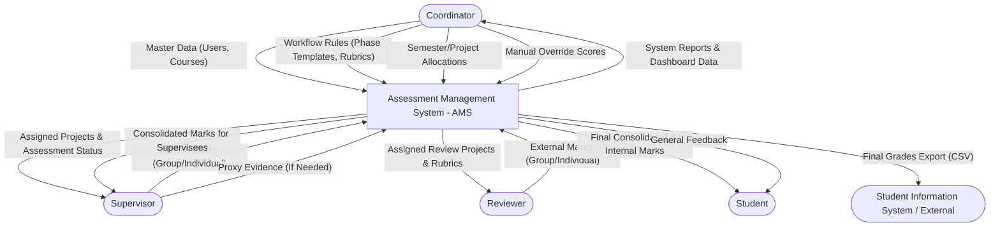
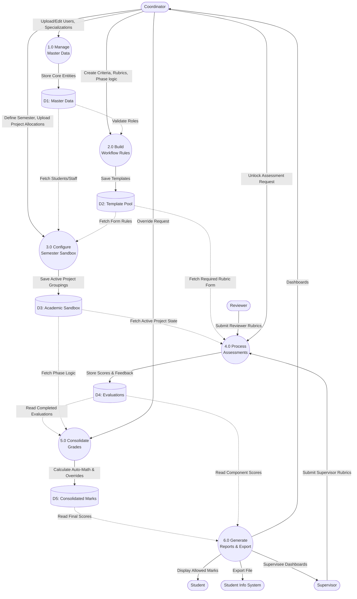

# Data Flow Diagram (DFD) for Assessment Management System (AMS)

This document maps out the Data Flow Diagram (DFD) for the AMS from Level 0 (Context) down to Level 1. 

## Level 0 Context Diagram
The Level 0 context diagram defines the boundary of the AMS system and its primary interactions with external entities.

---

## Level 1 DFD: Core Processes
The Level 1 DFD breaks down the main system into its distinct functional areas (processes) and shows how data moves between them and the core data stores.

### Legend
*   **External Entities:** Squared/Rounded nodes
*   **Processes (Functions):** Circles/Ovals
*   **Data Stores (Databases):** Cylinders

### Detailed Breakdown of Level 1 Processes
1.  **1.0 Manage Master Data:** Coordinator handles users, courses, and baseline academic routing constraints. *(Uses: Users, Departments, Specializations tables).*
2.  **2.0 Build Workflow Rules:** Coordinator creates the Rubrics, Criteria, and Phase structure logic. This defines *how* a project will be marked and handles the "Is Individual vs Group" boolean logic. *(Uses: Template Pool Tables).*
3.  **3.0 Configure Semester Sandbox:** Coordinator formally binds students to projects and links Supervisors/Reviewers to the appropriate phase templates. This "activates" the grading system for those users. *(Uses: Semesters, Projects, Project_Student, Project_Reviewer).*
4.  **4.0 Process Assessments:** Supervisors and Reviewers actually fill out their dynamic rubrics. The system enforces the rule that evaluations move from 'Draft' to 'Submitted' (locked). *(Uses: Evaluations, Evaluation Scores).*
5.  **5.0 Consolidate Grades:** When all required evaluations for a project reach the 'Submitted' state, the system automatically pulls the logic built in Step 2.0 (like Weights/Averages) and crunches the math to calculate final Phase marks. Coordinators can also apply manual overrides here. *(Uses: Consolidated Marks).*
6.  **6.0 Generate Reports & Export:** Pulls the finalized grade data. Distributes the internal/final component marks dynamically so Students only see what they are allowed to see, provides dashboards to staff, and allows Coordinators to export CSVs for external SIS data entry.
